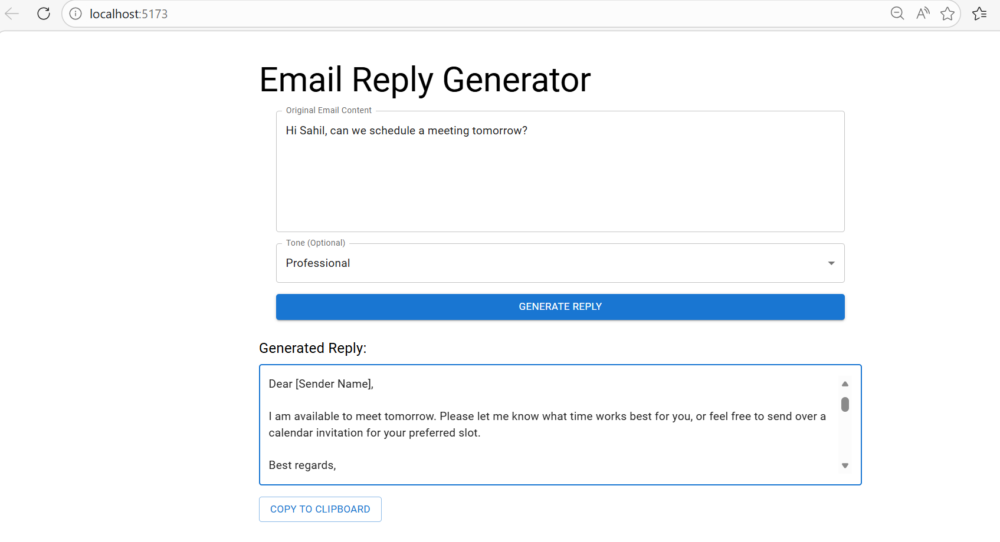
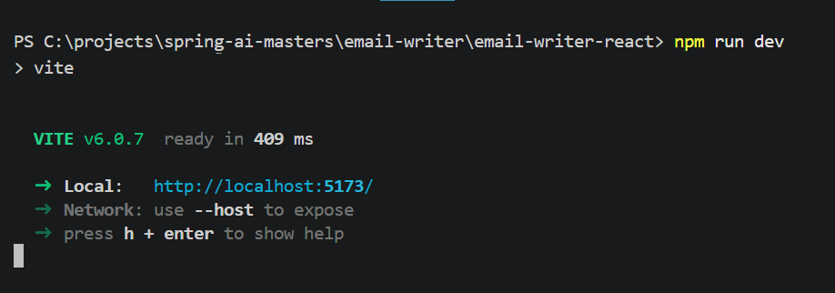
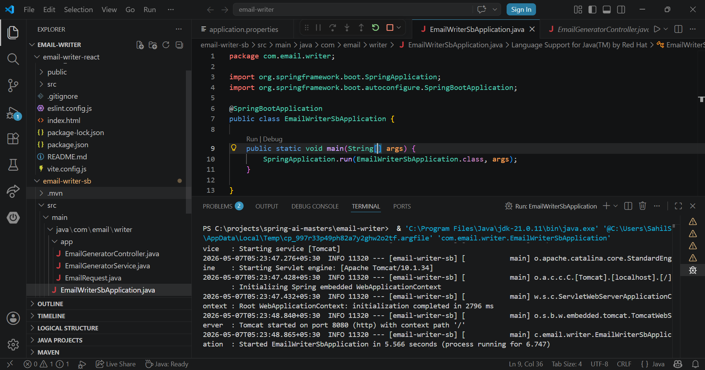
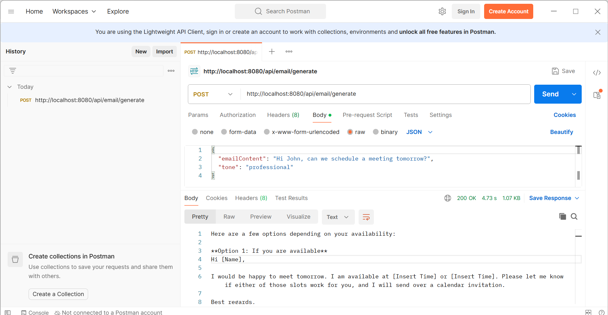

# 🚀 ReplyAI : Smart Email Assistant

An AI-powered email reply generator that creates professional and contextual email responses using **Google Gemini AI**.

Built with:


- ☕ Java + Spring Boot
- 🤖 Gemini AI API
- ⚛️ React + Vite

---

# ✨ Features

✅ Generate AI-powered email replies  
✅ Multiple tone selection  
✅ Clean React frontend  
✅ Spring Boot REST API backend  
✅ Gemini AI integration  
✅ Fast response generation  
✅ Full-stack architecture

---


# 🖥️ Application Preview

## 🔹 Output:



---

## 🔹 Code and Development Environment




---

## 🔹 API Testing with Postman



# 🛠️ Tech Stack


## Backend
- Java
- Spring Boot
- WebClient

## Frontend
- React
- Vite
- Material UI
- Axios

## AI Integration
- Google Gemini API


---

# ▶️ Backend Setup

```bash
cd email-writer-sb
```

Run:

```bash
mvn spring-boot:run
```

Backend runs on:

```text
http://localhost:8080
```

---

# ▶️ Frontend Setup

```bash
cd email-writer-react
```

Install dependencies:

```bash
npm install
```

Run frontend:

```bash
npm run dev
```

Frontend runs on:

```text
http://localhost:5173
```

---

# 🔐 Environment Variables

Created an `application.properties` file inside:

```text
src/main/resources/
```

Add:

```properties
gemini.api.url=YOUR_GEMINI_URL
gemini.api.key=YOUR_GEMINI_API_KEY
```

---

# 📡 API Endpoint

## Generate Email Reply

```http
POST /api/email/generate
```

### Request Body

```json
{
  "emailContent": "Hello, let's schedule a meeting tomorrow.",
  "tone": "professional"
}
```

---

# 📸 Screenshots Included

- Gemini API Key Setup
- Backend Running
- Postman Testing
- React Frontend
- AI Generated Output

---


# ⭐ Future Improvements

- Dark Mode
- Copy-to-Clipboard
- User Authentication
- Email Templates
- Deployment on Render/Vercel
- AI Tone Enhancements

---

# 📜 License

This project is for learning and portfolio purposes.
